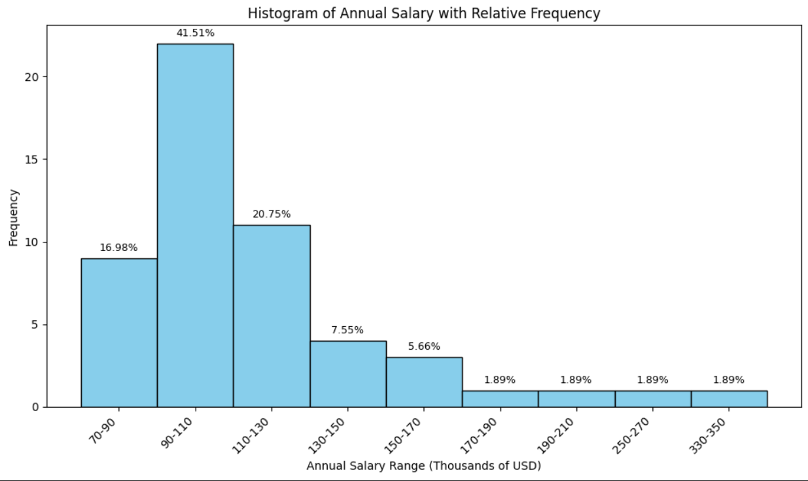

# **Numerical-Distributions**

This project demonstrates how to create a **numerical frequency distribution** with an **interval size of 20** and calculate **cumulative relative frequencies (%)** using **Excel, SQL, and Python**.

---

## **Tools and Skills**

* **Excel:** Using **Pivot Table** and formulas (compatible with both **Excel 365** and older versions).  
* **SQL:** Queries in **SQL Server Management Studio (SSMS)** with **`GROUP BY`** and **`SUM() OVER`** for cumulative calculations.  
* **Python:** Data analysis and visualization with **`pandas`**, **`numpy`**, **`matplotlib`** in **VS Code** using **Jupyter Notebook**.  
  Interval logic replicates SQL's `FLOOR` using **`//`** in Python.

---

## **Key Features**

* **Splits data into intervals** (bins) with a step of 20 (e.g., **70–90, 90–110**).  
* **Counts frequency** of values in each range.  
* **Calculates relative and cumulative relative frequencies (%).**  
* **Generates a summary table** and **plots a histogram** (Python).

---

## **Example of Summary Table**

| **Annual Salary Range** | **Frequency** | **RelFreq, %** | **CumRelFreq, %** |
|-------------------------|---------------|----------------|-------------------|
| 70-90                   | 9             | 16.98          | 16.98             |
| 90-110                  | 22            | 41.51          | 58.49             |
| 110-130                 | 11            | 20.75          | 79.25             |
| ...                     | ...           | ...            | ...               |

---

## **Python Visualization**

The Python script generates a **histogram with visible bar borders**, and **relative frequency percentages** are displayed above each bar.

 

